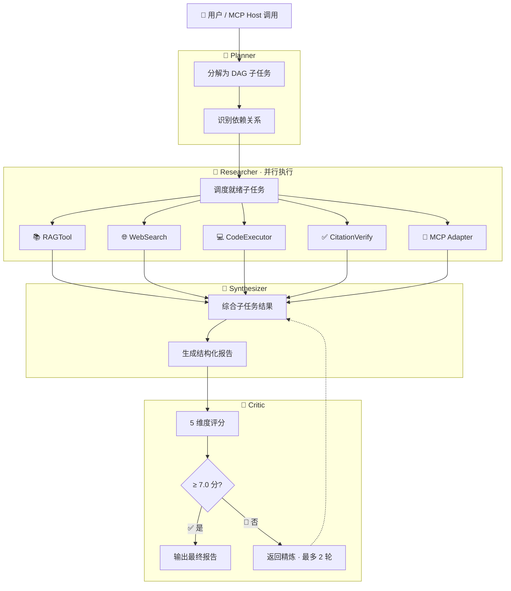

# MindForge MCP Server — 自适应研究助理

> **纯 MCP Server** · Multi-Agent RAG · MCP 协议 · GraphRAG · RAPTOR

[](LICENSE)
[](https://www.python.org/)

## 📖 目录

- [项目概述](#项目概述)
- [🎯 核心能力](#-核心能力)
- [🔄 工作流程](#-工作流程)
- [🛠️ 技术栈](#️-技术栈)
- [📁 项目结构](#-项目结构)
- [🚀 快速启动](#-快速启动)
- [🔌 MCP 协议集成](#-mcp-协议集成)
- [📄 许可证](#-许可证)

## 项目概述

MindForge 是一个基于 Multi-Agent 架构的自适应研究助理 **MCP Server**。它可以作为 Claude Code / Cline / Cursor 等 MCP Host 的工具后端，提供知识库检索、多步研究任务、引用验证和系统状态查询四类标准 MCP 工具。

### 🎯 核心能力

| 能力 | 说明 |
|------|------|
| 🧠 **智能任务分解** | Planner Agent 将复杂问题拆解为 DAG 子任务，自动识别依赖关系 |
| 🔍 **多源信息检索** | 同时检索内部知识库（Qdrant 向量库）和互联网实时信息 |
| 🎯 **自适应检索策略** | 根据问题类型（事实/概念/比较/流程/分析/关系）自动选择最优检索策略 |
| 🔄 **自我批评优化** | Critic Agent 从 5 个维度评分，低于阈值自动触发精炼循环 |
| 🔌 **标准化工具接入** | 通过 MCP 协议动态发现和调用外部工具，支持热插拔 |
| ⚡ **OpenAI / DeepSeek 双引擎** | 模型层抽象化，一键切换，适配 OpenAI 与 DeepSeek 全系模型 |
| 🧠 **记忆系统** | 工作记忆 + 情节记忆 + 语义记忆 三层架构 |
| 📊 **可观测性** | LangFuse + 本地 JSONL 追踪 |

### 🔄 工作流程



### 🛠️ 技术栈

| 层 | 技术 |
|---|------|
| 🤖 **Agent 框架** | Multi-Agent（Planner → Researcher → Synthesizer → Critic） |
| 🔎 **检索引擎** | Qdrant 向量库 + BM25 稀疏检索 + RRF 融合 + CrossEncoder 精排 |
| 🏗️ **层次化检索** | RAPTOR Tree（自底向上摘要树） |
| 🕸️ **图谱检索** | GraphRAG（跨文档实体关系发现） |
| 🔌 **工具协议** | MCP（Model Context Protocol）— 标准化工具接入 |
| 🧩 **LLM** | OpenAI GPT-4o / DeepSeek（deepseek-chat / deepseek-reasoner）一键切换 |
| 🧠 **记忆系统** | 工作记忆 + 情节记忆 + 语义记忆 三层架构 |
| ⚡ **配置** | pydantic-settings + .env 环境变量 |
| 📊 **可观测** | LangFuse + 本地 JSONL 追踪 |
| 🔤 **Embedding** | BGE-M3 (1024维) / BGE-small-zh (512维) / OpenAI / hash fallback |
| 🗄️ **数据库** | PostgreSQL 16 优先 · SQLite 回退 · SQLAlchemy ORM |
| 🐳 **部署** | Docker Compose（Qdrant + Redis + PostgreSQL） |

## 📁 项目结构

```
MindForge/
├── pyproject.toml                  # Python 依赖管理
├── docker-compose.yml              # Docker 编排（Qdrant + Redis + PostgreSQL）
├── Dockerfile                      # 容器构建
├── .env.example                    # 环境变量模板
├── .github/workflows/ci.yml        # CI/CD（ruff + pytest）
│
├── src/mindforge/                  # Python 后端
│   ├── config.py                   # 统一配置管理（Pydantic Settings）
│   ├── agents/                     # Multi-Agent 系统
│   │   ├── base.py                 # Agent 基类
│   │   ├── planner.py              # Planner Agent（DAG 任务分解）
│   │   ├── researcher.py           # Researcher Agent（ReAct 循环）
│   │   ├── critic.py               # Critic Agent（5 维质量评估）
│   │   ├── synthesizer.py          # Synthesizer Agent（报告生成）
│   │   └── orchestrator.py         # 编排器（多 Agent 调度）
│   ├── retrieval/                  # 检索系统
│   │   ├── vector_store.py         # Qdrant 向量库封装
│   │   ├── bm25.py                 # BM25 稀疏检索
│   │   ├── hybrid.py               # 混合检索 + RRF 融合
│   │   ├── reranker.py             # CrossEncoder 精排
│   │   ├── adaptive.py             # 自适应检索策略路由
│   │   └── graphrag.py             # GraphRAG 引擎
│   ├── ingestion/                  # 文档处理流水线
│   │   ├── parsers.py              # 多格式解析（PDF/DOCX/HTML/MD/TXT）
│   │   ├── chunker.py              # 文本分块
│   │   ├── embedder.py             # Embedding 引擎
│   │   └── raptor.py               # RAPTOR 层次化索引
│   ├── tools/                      # Agent 工具集
│   │   ├── rag_tool.py             # 知识库检索
│   │   ├── web_search.py           # 网络搜索
│   │   ├── code_executor.py        # 代码执行
│   │   ├── citation_verifier.py    # 引用验证
│   │   └── mcp_adapter.py          # MCP 工具适配
│   ├── mcp/                        # MCP 协议实现
│   │   ├── server.py               # MCP Server（stdio / HTTP SSE）
│   │   ├── client.py               # MCP Client（调用外部工具）
│   │   └── registry.py             # MCP 注册表（进程管理）
│   ├── models/                     # LLM 适配器
│   │   ├── base.py                 # 抽象基类 + 工厂
│   │   ├── openai_adapter.py       # OpenAI 适配
│   │   └── deepseek_adapter.py     # DeepSeek 适配
│   ├── memory/                     # 三层记忆系统
│   │   ├── working.py              # 工作记忆
│   │   ├── episodic.py             # 情节记忆
│   │   └── semantic.py             # 语义记忆
│   └── observability/              # 追踪 & 指标
│       ├── tracer.py               # LangFuse + JSONL
│       └── metrics.py              # Token / 工具调用统计
│
├── tests/                          # Python 测试（pytest + pytest-cov）
├── scripts/                        # CLI 辅助脚本
└── data/                           # 文档存放目录
```

## 🚀 快速启动

### 环境要求

| 组件 | 要求 | 说明 |
|------|------|------|
| 🐍 Python | `>= 3.9` | 推荐 3.11+ |
| 🐳 Docker | 可选 | Qdrant + Redis + PostgreSQL 基础设施 |

### 安装与配置

```bash
git clone <repo-url> && cd MindForge
git checkout mcp-server

# 安装依赖
pip install -e .

# 配置环境变量
cp .env.example .env
# 编辑 .env，设置 LLM 供应商和 API Key

# 启动基础设施（Qdrant + Redis + PostgreSQL）
docker compose up -d

# 索引文档
python scripts/run_research.py
```

### 作为 MCP Server 运行

```bash
# stdio 模式（本地 Claude Code / Cline）
python -m mindforge.mcp.server

# 或通过 CLI 入口
mindforge-mcp-server
```

## 🔌 MCP 协议集成

### 在 Claude Code 中使用

在 `~/.claude/mcp.json` 中添加：

```json
{
  "mcpServers": {
    "mindforge": {
      "command": "python",
      "args": ["-m", "mindforge.mcp.server"],
      "env": {
        "LLM_LLM_PROVIDER": "deepseek",
        "LLM_DEEPSEEK_API_KEY": "sk-xxx",
        "VECTOR_QDRANT_URL": "http://localhost:6333"
      }
    }
  }
}
```

### 暴露的 MCP 工具

| 工具 | 说明 |
|------|------|
| `search_knowledge_base` | 搜索知识库（无需 LLM，无 API Key 也可用） |
| `run_research_task` | 多步研究任务（需要 LLM API Key，无 Key 时自动降级为检索+网络搜索） |
| `verify_citation` | 验证报告中的引用标记 [N] |
| `system_status` | 系统状态、内存使用、运行时间 |

### MCP Client 模式（调用外部工具）

在项目根目录的 `.mcp.json` 中配置外部 MCP Server：

```json
{
  "mcpServers": {
    "github": {
      "command": "npx",
      "args": ["-y", "@modelcontextprotocol/server-github"],
      "env": { "GITHUB_TOKEN": "ghp_xxx" }
    },
    "qdrant": {
      "command": "uvx",
      "args": ["mcp-server-qdrant"],
      "env": { "QDRANT_URL": "http://localhost:6333" }
    }
  }
}
```

## 📄 许可证

本项目基于 [MIT 协议](LICENSE) 开源，可自由使用、修改和分发。

---

<p align="center">
  <sub>Built with ❤️ using Python · Qdrant · MCP</sub>
</p>
