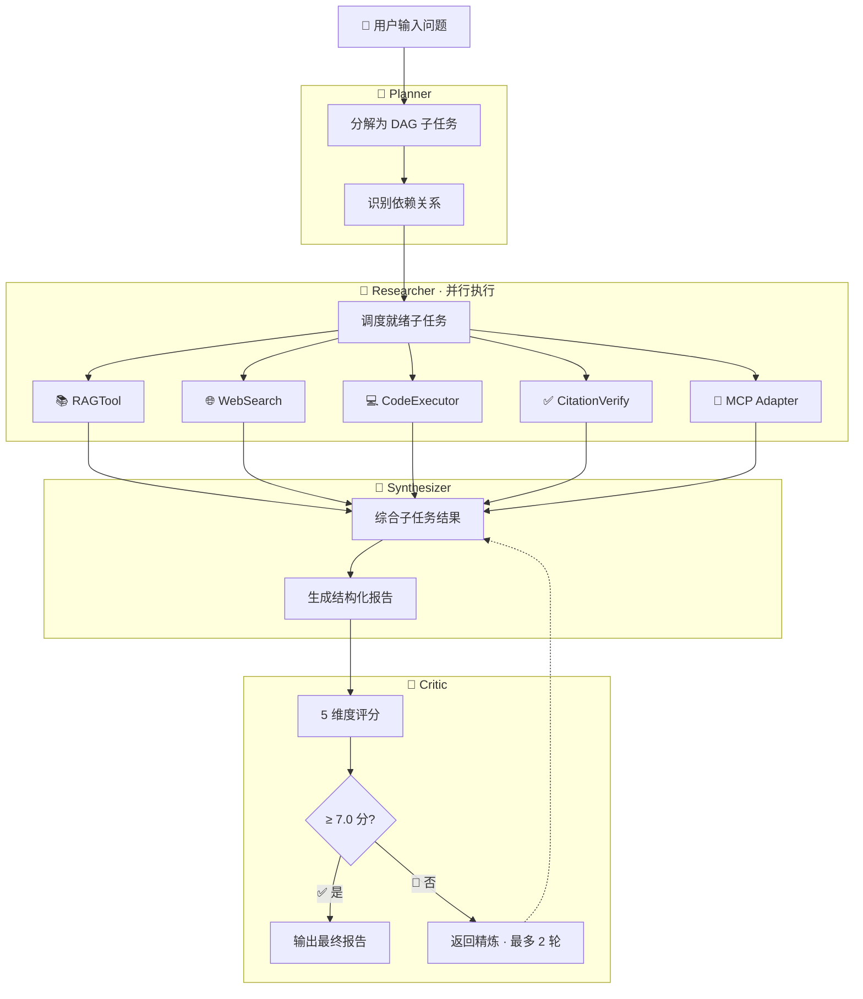

# MindForge — 自适应研究助理系统

> **全栈 Multi-Agent RAG** · React 19 前端 · FastAPI 后端 · MCP 协议 · GraphRAG · SSE 流式

[](https://github.com/blankbrains/MindForge/actions/workflows/ci.yml)

## 项目概述

MindForge 是一个基于 Multi-Agent 架构的自适应研究助理系统，由 **Python 后端**（FastAPI + Multi-Agent RAG）和 **React 前端**（TypeScript + Tailwind CSS + shadcn/ui）构成。它能够接收用户提出的复杂研究问题，自动将问题分解为 DAG 子任务，并行检索知识库和互联网信息，综合多源信息生成结构化的研究报告，并通过自我批评机制迭代优化输出质量。

### 🖥️ 前端界面

| 页面 | 功能 |
|------|------|
| 📊 **概览 Dashboard** | 服务状态（Qdrant / Redis / MCP）+ 快捷操作入口 |
| 🔬 **研究工作台** | 输入问题 → 实时查看 Agent DAG / 子任务进度 / Critic 雷达图 / Markdown 报告 |
| 📚 **知识库** | 文档上传（支持 RAPTOR + GraphRAG 索引）、文档列表、状态统计 |
| 🕐 **研究历史** | 自动捕获研究结果、可展开预览、删除 / 清空管理 |
| ⚙️ **系统配置** | LLM 供应商切换、检索参数、Agent 参数管理 |

### 🎯 核心能力

| 能力 | 说明 |
|------|------|
| 🧠 **智能任务分解** | Planner Agent 将复杂问题拆解为 DAG 子任务，自动识别依赖关系 |
| 🔍 **多源信息检索** | 同时检索内部知识库（Qdrant 向量库）和互联网实时信息 |
| 🎯 **自适应检索策略** | 根据问题类型（事实/概念/比较/流程/分析/关系）自动选择最优检索策略 |
| 🔄 **自我批评优化** | Critic Agent 从 5 个维度评分，低于阈值自动触发精炼循环 |
| 🔌 **标准化工具接入** | 通过 MCP 协议动态发现和调用外部工具，支持热插拔 |
| ⚡ **OpenAI / DeepSeek 双引擎** | 模型层抽象化，一键切换，适配 OpenAI 与 DeepSeek 全系模型 |
| 📡 **SSE 流式输出** | 实时推送 Agent 思考过程、工具调用、合成进度 |
| 🎨 **React 19 前端** | 暗色模式、响应式布局、React Flow DAG 可视化、Recharts 雷达图 |

### 🔄 工作流程



### 🛠️ 技术栈

| 层 | 技术 |
|---|------|
| 🖥️ **前端框架** | React 19 · TypeScript · Tailwind CSS v4 · shadcn/ui · Vite |
| 🗂️ **前端状态** | TanStack Router · TanStack Query · Zustand |
| 📈 **前端可视化** | React Flow（DAG）· Recharts（雷达图）· react-markdown（报告渲染） |
| 🤖 **Agent 框架** | Multi-Agent（Planner → Researcher → Synthesizer → Critic） |
| 🔎 **检索引擎** | Qdrant 向量库 + BM25 稀疏检索 + RRF 融合 + CrossEncoder 精排 |
| 🏗️ **层次化检索** | RAPTOR Tree（自底向上摘要树） |
| 🕸️ **图谱检索** | GraphRAG（跨文档实体关系发现） |
| 🔌 **工具协议** | MCP（Model Context Protocol）— 标准化工具接入 |
| 🧩 **模型** | OpenAI GPT-4o / DeepSeek（deepseek-chat / deepseek-reasoner）一键切换 |
| 🧠 **记忆系统** | 工作记忆 + 情节记忆 + 语义记忆 三层架构 |
| ⚡ **API** | FastAPI + SSE 流式 + Pydantic v2 |
| 📊 **可观测** | LangFuse + 本地 JSONL 追踪 |
| 🐳 **部署** | Docker Compose（Qdrant + Redis + API）· 前端构建后 FastAPI 托管 |

## 📁 项目结构

```
MindForge/
├── pyproject.toml                  # 后端依赖管理（Python）
├── docker-compose.yml              # Docker 编排（Qdrant + Redis）
├── Dockerfile                      # 容器构建
├── .env.example                    # 环境变量模板
├── .github/workflows/ci.yml        # CI/CD（ruff + pytest）
│
├── mindforge-web/                  # React 前端
│   ├── package.json                # 前端依赖（npm）
│   ├── vite.config.ts              # Vite 构建配置 + API 代理
│   ├── tsconfig.json               # TypeScript 严格模式
│   ├── index.html                  # SPA 入口
│   └── src/
│       ├── main.tsx                # React 根组件（ErrorBoundary 包裹）
│       ├── index.css               # Tailwind + CSS 变量主题
│       ├── routeTree.ts            # 路由树
│       ├── types/                  # TypeScript 类型定义
│       │   ├── api.ts              # API 响应类型
│       │   ├── research.ts         # Agent / SSE / 研究类型
│       │   └── document.ts         # 文档类型
│       ├── lib/                    # 工具函数
│       │   ├── api.ts              # HTTP 客户端（统一错误处理）
│       │   ├── sse-parser.ts       # SSE 流式解析器
│       │   ├── constants.ts        # API 路径常量
│       │   └── utils.ts            # cn() / 格式化 / 日期
│       ├── store/                  # Zustand 状态管理
│       │   ├── research-store.ts   # 研究会话状态（SSE 事件 handler）
│       │   ├── ui-store.ts         # UI 状态（主题/侧边栏）
│       │   ├── history-store.ts    # 研究历史（自动捕获，上限 100）
│       │   └── settings-store.ts   # LLM/检索/Agent 配置
│       ├── hooks/                  # 自定义 Hooks
│       │   ├── use-research-session.ts  # 研究会话生命周期（SSE + 历史）
│       │   ├── use-health.ts       # /health 轮询
│       │   ├── use-stats.ts        # /stats 轮询
│       │   ├── use-documents.ts    # 文档 CRUD
│       │   └── use-media-query.ts  # 响应式断点
│       ├── components/
│       │   ├── layout/             # AppShell / Sidebar / Header
│       │   ├── research/           # QueryInput / PlanDAG / ReportViewer / CriticPanel
│       │   ├── dashboard/          # StatusCardsGrid
│       │   ├── pages/              # 页面组件（5 个）
│       │   └── shared/             # EmptyState / ErrorBoundary / LoadingSkeleton
│       └── routes/                 # 路由定义（薄壳，每个文件只 export Route）
│
├── src/mindforge/                  # Python 后端
│   ├── config.py                   # 统一配置管理（Pydantic Settings）
│   ├── ingestion/                  # 文档处理流水线
│   │   ├── parsers.py              # 多格式解析（PDF/DOCX/HTML/MD/TXT）
│   │   ├── chunker.py              # 文本分块（递归分割 + 语义分割）
│   │   ├── embedder.py             # Embedding（SentenceTransformer / OpenAI / fallback）
│   │   └── raptor.py               # RAPTOR 层次化索引
│   ├── retrieval/                  # 检索系统
│   │   ├── vector_store.py         # Qdrant 向量库封装
│   │   ├── bm25.py                 # BM25 稀疏检索
│   │   ├── hybrid.py               # 混合检索 + RRF 融合
│   │   ├── reranker.py             # CrossEncoder 精排
│   │   ├── adaptive.py             # 自适应检索策略路由
│   │   └── graphrag.py             # GraphRAG 引擎
│   ├── agents/                     # Multi-Agent 系统
│   │   ├── base.py                 # Agent 基类
│   │   ├── planner.py              # Planner Agent（DAG 任务分解）
│   │   ├── researcher.py           # Researcher Agent（ReAct 循环）
│   │   ├── critic.py               # Critic Agent（5 维质量评估）
│   │   ├── synthesizer.py          # Synthesizer Agent（报告生成）
│   │   └── orchestrator.py         # 编排器（多 Agent 调度 + SSE 事件）
│   ├── memory/                     # 三层记忆系统
│   ├── tools/                      # Agent 工具集（RAG/Web/Code/Citation/MCP）
│   ├── mcp/                        # MCP 协议（Server + Client 双端）
│   ├── models/                     # LLM 适配器（OpenAI / DeepSeek）
│   ├── observability/              # 追踪 & 指标（LangFuse + JSONL）
│   └── api/                        # FastAPI 路由 + 静态文件托管
│       ├── schemas.py              # Pydantic 请求/响应模型
│       ├── routes.py               # REST + SSE 路由
│       └── server.py               # 应用入口（启动时构建前端后托管）
│
├── tests/                          # Python 测试（pytest + pytest-cov）
│   ├── test_retrieval.py           # 检索系统测试（40 个）
│   ├── test_mcp_adapter.py         # MCP 适配器测试
│   └── test_models.py              # 模型适配器测试
│
├── scripts/                        # CLI 辅助脚本
└── data/                           # 文档存放目录
```

## 🚀 快速启动

### 环境要求

| 组件 | 要求 | 说明 |
|------|------|------|
| 🐍 Python | `>= 3.9` | 推荐 3.11+ |
| 🐳 Docker | 可选 | 用于 Qdrant + Redis 基础设施，无 Docker 时可跳过检索功能运行 |
| 🟢 Node.js | `>= 18` | 前端构建 / 开发 |
| 📦 npm | `>= 9` | 随 Node.js 18+ 附带 |

### 🐍 1. 启动后端

```bash
git clone <repo-url> && cd MindForge

# 安装依赖
pip install -e ".[dev]"

# 配置环境变量
cp .env.example .env
# 编辑 .env，设置 LLM 供应商和 API Key

# 启动基础设施（Qdrant + Redis）
docker compose up -d

# 启动 API 服务
cd src && uvicorn mindforge.api.server:app --reload --port 8000
```

### 🟢 2. 启动前端

```bash
cd mindforge-web
npm install
npm run dev     # 开发模式 → http://localhost:5173
```

开发模式下 Vite 自动将 `/api/*` 代理到 `http://localhost:8000`，前后端分离开发。

### 🚢 3. 生产部署（单端口）

```bash
cd mindforge-web && npm run build   # 构建前端到 dist/
cd ../src && uvicorn mindforge.api.server:app --host 0.0.0.0 --port 8000
```

打开 **`http://localhost:8000`** — FastAPI 同时托管 API 和前端静态文件，一个端口搞定。

## 🔌 MCP 协议集成

MindForge 实现了**双向 MCP**：既可以作为 MCP Client 调用外部工具，也可以作为 MCP Server 暴露自身能力。

### 📤 作为 MCP Server（给 MCP Host 使用）

在支持 MCP 协议的客户端（Claude Code、Cline、Cursor、Continue 等）的 `mcp.json` 中添加：

```json
{
  "mcpServers": {
    "mindforge": {
      "command": "python",
      "args": ["-m", "mindforge.mcp.server"],
      "env": {
        "LLM_LLM_PROVIDER": "deepseek",
        "LLM_DEEPSEEK_API_KEY": "sk-xxx"
      }
    }
  }
}
```

或通过 HTTP 远程访问：

```json
{
  "mcpServers": {
    "mindforge": {
      "url": "http://your-server:8000/api/v1/mcp",
      "transport": "sse"
    }
  }
}
```

暴露的工具：`search_knowledge_base` · `run_research_task` · `verify_citation` · `system_status`

### 📥 作为 MCP Client（接入外部工具）

在项目根目录的 `mcp.json` 中配置外部 MCP Server，Researcher Agent 的 ReAct 循环会自动发现并调用：

```json
{
  "mcpServers": {
    "context7": { "command": "npx", "args": ["-y", "@upstash/context7-mcp"] },
    "github": {
      "command": "npx",
      "args": ["-y", "@github/github-mcp-server"],
      "env": { "GITHUB_TOKEN": "ghp_xxx" }
    }
  }
}
```

## 🔄 CI/CD

GitHub Actions 自动运行：

- **ruff check** — Python 代码风格 + import 顺序
- **pytest + coverage** — 40 个单元测试（跳过 `integration` 标记的测试）
- Qdrant + Redis 作为 Service Container 提供基础设施

## ✨ 技术亮点

### 🧠 自适应 Agent 编排

- **DAG 任务分解** — 复杂问题自动拆解为有依赖关系的子任务，识别哪些可并行、哪些需串行
- **ReAct 工具循环** — Researcher Agent 遵循 Thought → Action → Observation 模式，逐步收集证据
- **Self-Refine 精炼** — Critic 从完整性、准确性、深度、清晰度、引用质量 5 维度评分，不合格自动打回重写

### 📡 MCP 双向协议

- **Server 端** — 将 MindForge 的检索和研究能力暴露为 4 个标准 MCP 工具，支持 MCP 协议的客户端（Claude Code、Cline、Cursor 等）可直接调用
- **Client 端** — Researcher Agent 可动态发现并调用外部 MCP Server（如 GitHub、Context7），支持热插拔

### 🔍 自适应混合检索

- **6 种查询意图分类** — 事实 / 概念 / 比较 / 流程 / 分析 / 关系，每种自动选择最优检索策略
- **HyDE + Multi-Query** — 概念类查询生成假设文档再检索，比较类查询多角度改写
- **RRF 融合 + CrossEncoder** — 稠密向量 + 稀疏 BM25 倒数秩融合，再经交叉编码器精排
- **RAPTOR + GraphRAG** — 文档层次化摘要树 + 跨文档实体关系图双重索引

### 🎨 现代化前端体验

- **实时可视化** — React Flow 渲染 DAG 执行图，Recharts 雷达图展示 Critic 评分，Markdown 渲染报告
- **暗色模式** — CSS 变量驱动，一键切换，自动跟随系统偏好
- **SSE 流式渲染** — 后端事件逐条推送，前端实时更新 Agent 思考过程、工具调用、合成进度
- **响应式布局** — 桌面侧边栏 + 移动端底部导航，Tailwind CSS 断点适配

### 🔧 工程化

- **TypeScript 严格模式** — `noUnusedLocals` + `noUnusedParameters` 全开，零类型错误
- **Zustand 选择器模式** — 精准订阅，避免不必要的重渲染
- **单端口部署** — 前端构建后由 FastAPI 直接托管，无需 Nginx 反向代理
- **CI/CD** — GitHub Actions 自动 ruff 检查 + pytest 40 个测试 + coverage 报告