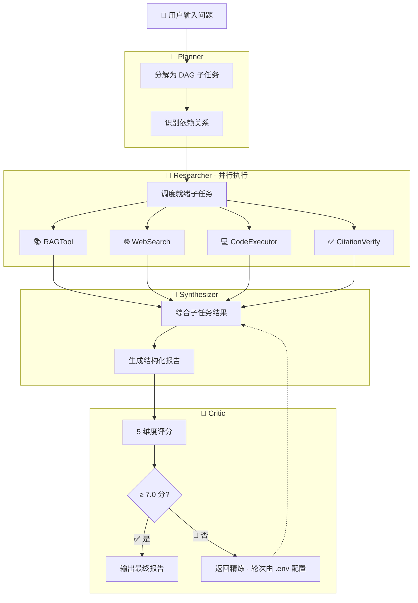

# MindForge — 自适应研究助理系统

> **全栈 Multi-Agent RAG** · React 19 前端 · FastAPI 后端 · GraphRAG · SSE 流式

[](https://github.com/blankbrains/MindForge/actions/workflows/ci.yml)

## 项目概述

MindForge 是一个基于 Multi-Agent 架构的自适应研究助理系统，由 **Python 后端**（FastAPI + Multi-Agent RAG）和 **React 前端**（TypeScript + Tailwind CSS）构成。它能够接收用户提出的复杂研究问题，自动将问题分解为 DAG 子任务，并行检索知识库和互联网信息，综合多源信息生成结构化的研究报告，并通过自我批评机制迭代优化输出质量。

### 🖥️ 前端界面

| 页面 | 功能 |
|------|------|
| 📊 **概览 Dashboard** | 服务状态（Qdrant / Redis / PostgreSQL）+ 快捷操作入口 |
| 🔬 **研究工作台** | 输入问题 → 实时查看 Agent DAG / 子任务进度 / Critic 雷达图 / Markdown 报告、可点击来源、Token 与估算费用 |
| 📚 **知识库** | 文档上传（支持 RAPTOR + GraphRAG 索引）、文档列表、状态统计 |
| 🕐 **研究历史** | 自动捕获研究结果、保留可点击引用、Markdown/代码高亮预览、删除 / 清空管理 |
| 📈 **可观测** | 以研究问题为标题查看完整 Trace、Agent/LLM/工具层级、耗时、费用与失败原因 |
| ⚙️ **系统配置** | 模型、检索相关性、研究模式、超时预算、历史保留与 Langfuse 配置 |

### 🎯 核心能力

| 能力 | 说明 |
|------|------|
| 🧠 **智能任务分解** | Planner Agent 将复杂问题拆解为 DAG 子任务，自动识别依赖关系 |
| 🔍 **多源信息检索** | 同时检索内部知识库（Qdrant 向量库）和互联网实时信息 |
| 🎯 **自适应检索策略** | 根据问题类型（事实/概念/比较/流程/分析/关系）自动选择最优检索策略 |
| 🔄 **自我批评优化** | Critic Agent 从 5 个维度评分，低于阈值自动触发精炼循环 |
| 🧱 **可靠索引流水线** | 解析、分块、批量 Embedding、向量校验、RAPTOR/GraphRAG 与失败回滚 |
| 📄 **自适应文档解析** | 原生 PDF 文本优先、按页 OCR 兜底；保留块级阅读顺序、表格结构、图片资产、页码、坐标、置信度与来源方法 |
| 🖼️ **可选视觉检索** | 图片与 OCR 页面预览可持久化；显式启用兼容视觉模型后，以事实描述进入既有文本检索链路 |
| ⚡ **统一多模型接口** | OpenAI、DeepSeek、兼容云 API 与服务器本地模型使用同一套 Agent 接口 |
| 📡 **SSE 流式输出** | 实时推送 Agent 思考过程、工具调用、合成进度 |
| 🎨 **React 19 前端** | 暗色模式、响应式布局、React Flow DAG 可视化、Recharts 雷达图 |

### 🔄 工作流程


```mermaid
flowchart TD
    A[🙋 用户输入问题] --> B1
    subgraph B[🧠 Planner]
        B1[分解为 DAG 子任务] --> B2[识别依赖关系]
    end
    B2 --> C0
    subgraph C[🔬 Researcher · 并行执行]
        C0[调度就绪子任务]
        C1[📚 RAGTool]
        C2[🌐 WebSearch]
        C3[💻 CodeExecutor]
        C4[✅ CitationVerify]
    end
    C0 --> C1
    C0 --> C2
    C0 --> C3
    C0 --> C4
    C1 --> D1
    C2 --> D1
    C3 --> D1
    C4 --> D1
    subgraph D[📝 Synthesizer]
        D1[综合子任务结果] --> D2[生成结构化报告]
    end
    D2 --> E1
    subgraph E[🎯 Critic]
        E1[5 维度评分] --> E2{"≥ 7.0 分?"}
        E2 -- ✅ 是 --> E3[输出最终报告]
        E2 -- 🔄 否 --> E4[返回精炼 · 轮次由 .env 配置]
    end
    E4 -.-> D1
```

### 🛠️ 技术栈

| 层 | 技术 |
|---|------|
| 🖥️ **前端框架** | React 19 · TypeScript · Tailwind CSS v4 · Vite |
| 🗂️ **前端状态** | TanStack Router · TanStack Query · Zustand |
| 📈 **前端可视化** | React Flow（DAG）· Recharts（雷达图）· react-markdown（报告渲染） |
| 🤖 **Agent 框架** | Multi-Agent（Planner → Researcher → Synthesizer → Critic） |
| 🔎 **检索引擎** | Qdrant 向量库 + BM25 稀疏检索 + RRF 融合 + CrossEncoder 精排 |
| 🏗️ **层次化检索** | RAPTOR Tree（自底向上摘要树） |
| 🕸️ **图谱检索** | GraphRAG（跨文档实体关系发现） |
| 🧰 **Agent 工具** | 知识库检索 · Web 搜索 · 代码执行 · 引用支持检查 |
| 🧩 **模型** | 注册表驱动 `LLMFactory`；内置 OpenAI、DeepSeek、OpenAI-compatible 与 Local Provider |
| 🧠 **记忆系统** | 工作记忆 + 情节记忆 + 语义记忆 三层架构 |
| 🔤 **Embedding** | BGE-M3 (1024维) 或 OpenAI；显式后端失败时拒绝写入不兼容向量 |
| 📄 **文档解析** | pdfplumber + PaddleOCR 3；混合 PDF 按页处理，表格保留 Markdown + HTML + 单元格 JSON，图片与源文件具备生命周期管理 |
| 🗄️ **数据库** | PostgreSQL 16 · SQLAlchemy ORM |
| ⚡ **API** | FastAPI + SSE 流式 + Pydantic v2 + streaming answer_chunk |
| 📊 **可观测** | 每次研究一个以问题命名的顶层 Trace；本地 JSONL + Langfuse 3 双写，内容默认脱敏 |
| 🐳 **部署** | Docker Compose（Qdrant + Redis + PostgreSQL）· 前端构建后 FastAPI 托管 |
| 🔧 **一键启动** | `bash start.sh`（关旧→基础设施→依赖→前端→后端→健康检查） |

## 📁 项目结构

```
MindForge/
├── start.sh                        # 一键启动脚本
├── pyproject.toml                  # 后端依赖管理（Python）
├── docker-compose.yml              # Docker 编排（Qdrant + Redis + PostgreSQL）
├── Dockerfile                      # 容器构建
├── migrations/                     # Alembic 数据库迁移
├── benchmarks/parser/               # 私有解析基准清单（语料与结果不提交）
├── .env.example                    # 环境变量模板
├── .github/workflows/ci.yml        # CI（ruff + pytest + frontend + Compose）
├── docs/                           # 项目说明、踩坑记录、面试材料
│
├── mindforge-web/                  # React 前端
│   ├── package.json                # 前端依赖（npm）
│   ├── vite.config.ts              # Vite 构建配置 + API 代理
│   ├── tsconfig.json               # TypeScript 严格模式
│   ├── index.html                  # SPA 入口
│   └── src/
│       ├── main.tsx                # React 根组件（ErrorBoundary 包裹）
│       ├── index.css               # Tailwind + CSS 变量主题
│       ├── routeTree.ts            # 路由树
│       ├── types/                  # TypeScript 类型定义
│       │   ├── api.ts              # API 响应类型
│       │   ├── research.ts         # Agent / SSE / 研究类型
│       │   ├── observability.ts    # Trace 列表、详情与观察类型
│       │   └── document.ts         # 文档类型
│       ├── lib/                    # 工具函数
│       │   ├── api.ts              # HTTP 客户端（统一错误处理）
│       │   ├── sse-parser.ts       # SSE 流式解析器
│       │   ├── constants.ts        # API 路径常量
│       │   └── utils.ts            # cn() / 格式化 / 日期
│       ├── store/                  # Zustand 状态管理
│       │   ├── research-store.ts   # 研究会话状态（SSE 事件 handler）
│       │   ├── ui-store.ts         # UI 状态（主题/侧边栏）
│       │   ├── history-store.ts    # 研究历史（自动捕获、分页加载、完整详情）
│       │   └── settings-store.ts   # LLM/检索/Agent 配置
│       ├── hooks/                  # 自定义 Hooks
│       │   ├── use-research-session.ts  # 研究会话生命周期（SSE + 历史）
│       │   ├── use-health.ts       # /health 轮询
│       │   ├── use-stats.ts        # /stats 轮询
│       │   ├── use-observability.ts # Trace 状态、列表与详情查询
│       │   ├── use-documents.ts    # 文档 CRUD
│       │   └── use-media-query.ts  # 响应式断点
│       ├── components/
│       │   ├── layout/             # AppShell / Sidebar / Header
│       │   ├── research/           # QueryInput / PlanDAG / ReportViewer / CriticPanel
│       │   ├── dashboard/          # StatusCardsGrid
│       │   ├── pages/              # 页面组件（6 个）
│       │   └── shared/             # EmptyState / ErrorBoundary / LoadingSkeleton
│       └── routes/                 # 路由定义（薄壳，每个文件只 export Route）
│
├── src/mindforge/                  # Python 后端
│   ├── config.py                   # 统一配置管理（Pydantic Settings）
│   ├── db.py                       # 数据库层（SQLAlchemy + PostgreSQL）
│   ├── ingestion/                  # 文档处理流水线
│   │   ├── parsers.py              # 自适应解析（原生 PDF/OCR/表格/图片元素）
│   │   ├── chunker.py              # 文本、语义与结构化元素感知分块
│   │   ├── embedder.py             # Embedding（SentenceTransformer / OpenAI）
│   │   ├── visual.py               # 可选视觉描述与图像检索 Chunk
│   │   └── raptor.py               # RAPTOR 层次化索引
│   ├── retrieval/                  # 检索系统
│   │   ├── vector_store.py         # Qdrant 向量库封装
│   │   ├── bm25.py                 # BM25 稀疏检索
│   │   ├── hybrid.py               # 混合检索 + RRF 融合
│   │   ├── reranker.py             # CrossEncoder 精排
│   │   ├── adaptive.py             # 自适应检索策略路由
│   │   └── graphrag.py             # GraphRAG 引擎
│   ├── agents/                     # Multi-Agent 系统
│   │   ├── base.py                 # Agent 基类
│   │   ├── planner.py              # Planner Agent（DAG 任务分解）
│   │   ├── researcher.py           # Researcher Agent（ReAct 循环）
│   │   ├── critic.py               # Critic Agent（5 维质量评估）
│   │   ├── synthesizer.py          # Synthesizer Agent（报告生成）
│   │   └── orchestrator.py         # 编排器（多 Agent 调度 + SSE 事件）
│   ├── memory/                     # 三层记忆系统
│   ├── tools/                      # Agent 工具集（RAG/Web/Code/Citation）
│   ├── repositories/               # PostgreSQL 文档目录、任务与资产 Repository
│   ├── services/                   # 健康监视、索引并发控制与资产生命周期
│   ├── models/                     # 统一 LLM 接口、Provider 注册表与兼容适配器
│   ├── observability/              # Trace 写入、摘要索引与只读查询
│   └── api/                        # FastAPI 路由 + 静态文件托管
│       ├── schemas.py              # Pydantic 请求/响应模型
│       ├── routes.py               # REST + SSE 路由
│       └── server.py               # 应用入口（启动时构建前端后托管）
│
├── tests/                          # Python 测试（pytest + pytest-cov）
│   ├── test_retrieval.py           # 检索、Agent 与真实 API 回归测试
│   ├── test_regressions.py         # 已确认生产问题的回归测试
│   ├── test_observability.py       # Trace 层级、脱敏与本地查询测试
│   └── test_models.py              # 模型适配器测试
│
├── scripts/                        # CLI 辅助脚本
│   └── benchmark_parser.py         # 私有解析语料的可重复基准运行器
└── data/                           # 文档存放目录
```

## 🚀 快速启动

### 环境要求

| 组件 | 要求 | 说明 |
|------|------|------|
| 🐍 Python | `>= 3.10` | 容器与 CI 使用 Python 3.11 |
| 🐳 Docker | 推荐 | 一次启动 Qdrant、Redis、PostgreSQL 和 MindForge |
| 🟢 Node.js | `>= 22` | 与 Dockerfile、CI 和 Vite 8 对齐 |
| 📦 npm | `>= 10` | 随 Node.js 22 附带 |

### 🐍 1. 启动后端

```bash
git clone <repo-url> && cd MindForge

# 安装依赖
pip install --require-hashes -r requirements-dev.lock

# 配置环境变量
cp .env.example .env
# 编辑 .env：设置 LLM API Key、强 PostgreSQL 密码和 DATABASE_URL
# DATABASE_URL 为必填项；应用不会回退到内置数据库连接串。

# 启动基础设施（Qdrant + Redis + PostgreSQL）
docker compose up -d qdrant redis postgres

# 启动 API 服务
python -m uvicorn mindforge.api.server:app --app-dir src --reload --port 8000
```

需要远程追踪时，可以直接编辑 `.env`，也可以在“系统配置 → 可观测”中填写并保存：
`OBSERVABILITY_LANGFUSE_PUBLIC_KEY`、`OBSERVABILITY_LANGFUSE_SECRET_KEY`
和 `OBSERVABILITY_LANGFUSE_HOST`。未配置时仍保留本地 JSONL；配置不完整或
Langfuse 初始化失败时会记录明确告警，不影响研究主流程。

每次研究都会建立一个 32 位 Trace ID，并形成
`Orchestrator -> Planner/Researcher/Synthesizer/Critic -> LLM/Tool`
父子链。列表与详情标题显示实际研究问题，内部根节点仍保留 Orchestrator 语义。
研究结果和历史详情中的“查看 Trace”会直接定位到对应链路；失败和检索降级会
保留原始原因。失败节点会记录阶段、错误码、异常类型、Agent、模型、尝试次数和
超时值，顶部只汇总主因；被上层超时连带取消的调用仍保留在具体链路中。
凭证通过设置 API 写入服务端 `.env`，重新读取时只返回掩码。

```bash
# 查看可观测状态
curl http://127.0.0.1:8000/api/v1/observability/status

# 查看最近 Trace
curl "http://127.0.0.1:8000/api/v1/observability/traces?limit=20"
```

默认 `OBSERVABILITY_CAPTURE_CONTENT=false`，任务、Prompt 和模型输出只记录类型与
大小。只有明确接受内容进入本地 Trace 和 Langfuse 后，才应将该项改为 `true`。
Trace 与研究历史默认永久保留，可在对应页面手动删除或清空。

### 🟢 2. 启动前端

```bash
cd mindforge-web
npm ci
npm run dev     # 开发模式 → http://localhost:5173
```

开发模式下 Vite 从项目根目录 `.env` 读取
`VITE_API_PROXY_TARGET`，并将 `/api/*` 转发到后端。

### 统一配置规则

项目根目录 `.env` 是所有运行时和部署参数的唯一配置源：

- 后端通过 Pydantic Settings 读取 `.env`
- Vite 通过 `envDir` 读取同一个 `.env`
- Docker Compose 自动读取同一个 `.env`
- QA 生成脚本通过 `QA_*` 参数读取模型、并发、批大小和输出目录

`DATABASE_URL` 是后端启动必填项，必须与 `POSTGRES_USER`、`POSTGRES_PASSWORD`
和 `POSTGRES_DB` 对应；缺失时应用会直接给出配置错误，而不会使用任何内置
数据库账号或连接串。

`.env.example` 包含完整键集合，实际 `.env` 不提交到 Git。`pyproject.toml`、
`package.json`、`docker-compose.yml`、Vite/TypeScript/ESLint 与 CI 文件是各工具
必须识别的结构文件，不存放密钥或部署环境值。

远程部署时不要用本地 `.env` 整文件覆盖服务器 `.env`。数据库端口、应用绑定
地址、容器主机名、数据目录及 `APP_UID/APP_GID` 可能因环境不同而变化；应
备份远端文件并按键合并新增配置，再执行 `docker compose config --quiet` 和
就绪检查。

LLM Provider 支持 `openai`、`deepseek`、`openai_compatible` 和 `local`。
兼容云 API 可接入提供 OpenAI-compatible Chat Completions 的服务；本地 Provider
用于连接同一服务器上的 vLLM、Ollama、LM Studio 等推理服务。各 Provider 独立
保存 Base URL、API Key、默认模型、四个 Agent 角色模型和工具/JSON 能力开关。
本地服务可关闭“需要 API Key”，但仍必须配置可访问的 Base URL 与模型名。

### 服务器完整操作流程

#### 1. 首次部署

```bash
git clone <repo-url> MindForge
cd MindForge
cp .env.example .env
```

编辑 `.env`，至少完成以下配置：

- 设置强随机 `POSTGRES_PASSWORD`，并让 `DATABASE_URL` 使用相同账号、密码和库名。
- 选择 `LLM_LLM_PROVIDER`，填写对应 Provider 的 Base URL、API Key 和模型。
- CPU 部署保持 `PYTHON_REQUIREMENTS_FILE=requirements-cpu.lock`；GPU 部署使用
  `requirements-gpu.lock` 并核对 `docker-compose.gpu.yml` 所需设备和驱动路径。
- 通过反向代理访问时保持 `DOCKER_API_BIND_ADDRESS=127.0.0.1`；仅在受控测试网络
  直接访问时改为 `0.0.0.0`。

配置检查和启动：

```bash
docker compose config --quiet
docker compose up -d --build
docker compose ps
curl --fail http://127.0.0.1:8000/api/v1/ready
```

GPU 部署使用：

```bash
docker compose -f docker-compose.yml -f docker-compose.gpu.yml \
  up -d --build
```

浏览器访问 `http://<服务器地址>:<API_PORT>`。若外部无法连接，依次检查
`DOCKER_API_BIND_ADDRESS`、服务器防火墙和反向代理；PostgreSQL、Redis、Qdrant
端口不应对外开放。

#### 2. 配置模型

1. 打开“系统配置”。
2. 在“LLM 供应商”中选择 Provider，填写 Base URL 和 API Key。
3. 点击“拉取模型”，再为 Planner、Researcher、Critic 和 Synthesizer
   从接口返回的模型列表中选择模型；接口不提供 `/models` 时可直接填写自定义模型 ID。
4. 按模型真实能力设置 Tool Calling、JSON Mode 和 JSON Schema。
5. 保存后确认状态为“可用”，再执行一次简单研究请求。

完整字段和本地模型命令见下方
[LLM 配置操作流程](#llm-配置操作流程)。

#### 3. 上传并建立知识库

1. 打开“知识库”，点击“上传文档”。
2. 选择 PDF、DOCX、Markdown、TXT 或 HTML 文件。
3. 按需启用 RAPTOR 层次索引或 GraphRAG 图谱索引；首次验证建议先关闭两者，
   确认基础解析和检索正常后再启用。
4. 点击“开始索引”。界面先显示文件传输进度，再显示解析、Embedding 和索引进度。
5. 等待状态变为“已索引”，随后可查看内容或删除文档。文档卡片只标记实际完成的
   RAPTOR/GraphRAG 索引；取消任务时系统会回滚未完成的向量、目录记录和解析资产。

#### 4. 发起研究

1. 打开“研究工作台”，输入问题。
2. 按 `Enter` 提交，`Shift+Enter` 换行。
3. LLM Provider 可用时，界面展示规划、子任务、综合和评判过程；Provider
   未就绪时自动使用知识库检索模式。问候类输入不会触发检索；命中的原始文档
   片段会明确标注为未总结内容，主流语言代码使用安全的高亮代码块展示。
4. 完成结果会保存到“研究历史”，历史详情与研究结果使用相同的 Markdown、
   代码高亮和引用渲染。正文 `[N]` 对应 Web 来源时在新标签页打开，对应内部
   知识库来源时跳到报告底部来源条目；GFM 表格带边框并在窄屏内横向滚动。
   成功完成后输入框自动清空，失败时保留原问题便于重试。

#### 5. 日常更新、排障和停止

```bash
# 拉取更新后重新校验并构建
git pull --ff-only
docker compose config --quiet
docker compose up -d --build

# 查看应用日志
docker compose logs -f --tail=200 mindforge

# 停止服务但保留容器和数据
docker compose stop

# 删除容器和网络但保留命名数据卷
docker compose down
```

不要使用 `docker compose down -v`，除非已经备份且明确需要删除数据库、向量库、
缓存和应用数据卷。

### LLM 配置操作流程

#### 方式一：通过设置页配置

1. 启动 MindForge 后访问：

   ```text
   http://<服务器地址>:<API_PORT>/settings
   ```

2. 进入“LLM 供应商”，选择 Provider：

   | 选项 | 适用情况 |
   |------|----------|
   | OpenAI | 直接使用 OpenAI API |
   | DeepSeek | 直接使用 DeepSeek API |
   | OpenAI 兼容接口 | 使用提供 OpenAI-compatible API 的云服务 |
   | 本地模型 | 连接服务器上的 vLLM、Ollama 或 LM Studio |

3. 填写连接参数：

   - **OpenAI**：Base URL 默认显示
     `https://api.openai.com/v1`，填写 API Key 后拉取账号可用模型。
   - **DeepSeek**：填写 API Key；Base URL 默认
     `https://api.deepseek.com`；当前角色模型填写 `deepseek-v4-flash`。
   - **兼容云 API**：填写供应商的 `/v1` Base URL、API Key 和准确模型 ID。
   - **本地模型**：填写容器可访问的 Base URL 和模型 ID；无鉴权时关闭
     “需要 API Key”。

4. 点击“拉取模型”：

   - 后端使用当前尚未保存的 Base URL 和新 Key 请求标准 `/models`。
   - 已保存的 Key 只在后端解密使用，不会把明文返回浏览器。
   - 成功后四个 Agent 字段变为模型下拉框；选择“自定义模型 ID”仍可手动输入。
   - 兼容云或本地接口没有 `/models` 时，直接手动填写模型 ID，不影响保存和调用。

5. 配置模型路由：

   - `Planner`：任务拆解，需要稳定结构化输出。
   - `Researcher`：检索和工具调用，需要 Tool Calling。
   - `Critic`：质量评分，需要稳定 JSON 输出。
   - `Synthesizer`：报告生成，建议使用长上下文模型。
   - 兼容云 API 和本地模型只填写“默认模型”也可以，角色模型留空时自动继承。

6. 配置接口能力：

   - 模型不支持 Tool Calling 时关闭“工具调用”。
   - 不支持 `json_object` 时关闭“JSON Mode”。
   - 不支持 `json_schema` 时关闭“JSON Schema”。
   - 不确定时先全部关闭，确认普通 Chat 成功后再逐项启用。

7. 点击“保存配置”。右上角显示“可用”后，进入研究页提交一个简单问题。
   如果仍显示“未就绪”，检查 Base URL、模型 ID，以及当前 Key 要求是否满足。

8. 按需要配置其余页签：
   - “检索”：设置 Top-K、语义相关性阈值和关键词覆盖阈值。重排序状态会区分
     正常、等待加载和加载失败；Tavily 是可选联网搜索后端，只有配置
     `TAVILY_API_KEY` 后才会启用。
   - “研究流程”：选择快速/均衡/深度模式、来源策略和回退开关；超时需满足
     `单次模型调用 <= 子任务 <= 研究总超时`。
   - “可观测”：可填写 Langfuse Host/公钥/私钥，并设置内容采集、Trace 和历史
     保留策略；`0` 表示永久保留。
   - 所有保存结果都写入服务端 `.env`，密钥重新读取时只返回掩码。

9. 通过 API 验证：

   ```bash
   curl -s http://127.0.0.1:8000/api/v1/settings
   curl --fail http://127.0.0.1:8000/api/v1/ready
   ```

   `llm_configured=true` 表示当前 Provider 已满足运行条件；API Key 只返回脱敏值。

#### 方式二：通过 `.env` 配置

OpenAI：

```dotenv
LLM_LLM_PROVIDER=openai
LLM_OPENAI_API_KEY=<your-key>
LLM_OPENAI_BASE_URL=https://api.openai.com/v1
LLM_PLANNER_MODEL=gpt-4o
LLM_RESEARCHER_MODEL=gpt-4o-mini
LLM_CRITIC_MODEL=gpt-4o
LLM_SYNTHESIZER_MODEL=gpt-4o
```

DeepSeek：

```dotenv
LLM_LLM_PROVIDER=deepseek
LLM_DEEPSEEK_API_KEY=<your-key>
LLM_DEEPSEEK_BASE_URL=https://api.deepseek.com
LLM_DEEPSEEK_PLANNER=deepseek-v4-flash
LLM_DEEPSEEK_RESEARCHER=deepseek-v4-flash
LLM_DEEPSEEK_CRITIC=deepseek-v4-flash
LLM_DEEPSEEK_SYNTHESIZER=deepseek-v4-flash
# 价格单位为 USD / 100 万 Token，必须按实际模型和供应商当前价格维护。
LLM_MODEL_PRICING={"deepseek:deepseek-v4-flash":{"input":0.14,"cached_input":0.0028,"output":0.28}}
```

OpenAI 兼容云 API：

```dotenv
LLM_LLM_PROVIDER=openai_compatible
LLM_COMPATIBLE_API_KEY=<your-key>
LLM_COMPATIBLE_BASE_URL=https://<provider-host>/v1
LLM_COMPATIBLE_API_KEY_REQUIRED=true
LLM_COMPATIBLE_MODEL=<model-id>
LLM_COMPATIBLE_SUPPORTS_TOOLS=true
LLM_COMPATIBLE_SUPPORTS_JSON_MODE=true
LLM_COMPATIBLE_SUPPORTS_JSON_SCHEMA=false
LLM_COMPATIBLE_SUPPORTS_STREAM_USAGE=false
```

服务器本地模型：

```dotenv
LLM_LLM_PROVIDER=local
LLM_LOCAL_API_KEY=
LLM_LOCAL_BASE_URL=http://host.docker.internal:11434/v1
LLM_LOCAL_API_KEY_REQUIRED=false
LLM_LOCAL_MODEL=qwen3:8b
LLM_LOCAL_SUPPORTS_TOOLS=true
LLM_LOCAL_SUPPORTS_JSON_MODE=true
LLM_LOCAL_SUPPORTS_JSON_SCHEMA=false
LLM_LOCAL_SUPPORTS_STREAM_USAGE=false
```

`LLM_MODEL_PRICING` 中的示例零值仅表示字段结构，部署时必须替换为供应商公布的
当前价格。系统展示的是基于 API Token 用量的**估算费用**，不是账单扣费结果。
未配置模型价格、API 未返回 usage、本地模型和仅部分调用可估算时会显示不同状态，
不会再把未知情况误报为 `$0`。兼容云或本地端点只有确认支持流式 usage 时才开启
对应的 `*_SUPPORTS_STREAM_USAGE`。

修改 `.env` 后执行：

```bash
docker compose config --quiet
docker compose up -d --build mindforge
curl --fail http://127.0.0.1:8000/api/v1/ready
```

#### 本地模型示例

Ollama：

```bash
ollama pull qwen3:8b
OLLAMA_HOST=0.0.0.0:11434 ollama serve
curl http://127.0.0.1:11434/v1/models
```

设置页填写：

```text
Base URL: http://host.docker.internal:11434/v1
默认模型: qwen3:8b
需要 API Key: 关闭
```

vLLM 建议避开 MindForge 的 8000 端口：

```bash
vllm serve <模型仓库或本地路径> --host 0.0.0.0 --port 8001
curl http://127.0.0.1:8001/v1/models
```

设置页填写：

```text
Base URL: http://host.docker.internal:8001/v1
默认模型: <接口返回的模型 ID>
```

检查应用容器能否访问宿主机模型服务：

```bash
docker compose exec mindforge getent hosts host.docker.internal
docker compose exec mindforge \
  curl -s http://host.docker.internal:11434/v1/models
```

模型 ID 必须以 `/v1/models` 的实际返回值为准。本地服务需监听 `0.0.0.0`；
容器内 `127.0.0.1` 指向 MindForge 容器自身，不是服务器宿主机。

完整操作、故障排查和安全要求见
[LLM Provider 配置与运维](docs/llm-provider-operations.md)。

### 🚢 3. 生产部署（单端口）

```bash
docker compose up -d --build
```

打开 `.env` 中 `API_PORT` 对应的地址。容器内 FastAPI 同时托管
API 和前端静态文件，并通过 `/api/v1/ready` 提供严格就绪探针。
`DOCKER_INFRA_BIND_ADDRESS` 默认只把 PostgreSQL、Redis、Qdrant 绑定到本机。
远程部署时必须通过启用 TLS/HTTPS 和身份认证的反向代理暴露
MindForge；不要直接公开应用或基础设施端口。
如果应用端口必须监听非回环地址，还必须配置至少 32 位随机
`API_ACCESS_TOKEN`，并由反向代理为 `/api/*` 请求注入
`Authorization: Bearer <token>`。未配置令牌时，MindForge 会拒绝非本机 API
访问，避免管理接口因端口误暴露而直接开放。

大 PDF 使用可配置的多进程页解析；上传通过持久化异步任务返回任务 ID，并提供
阶段、进度、取消和重启恢复。知识库页面不展示历史索引任务，也不轮询任务列表；
上传弹窗先显示字节级文件传输进度，再切换到当前文件的服务端索引进度。文档 ID
基于解析内容的 SHA-256，索引签名覆盖
分块、Embedding、RAPTOR/GraphRAG 的有效 Provider、模型和可用状态；只有 PostgreSQL、Qdrant 与 BM25
三方记录完整一致时才复用已有索引。

RAPTOR 会跳过单节点聚类，在生成摘要前检查节点上限，并对同层摘要执行批量
Embedding。GraphRAG 从文档首中尾均匀取样，在私有图副本上完成构建后原子替换，
未变化社区复用已有摘要；`graph` 模式会并行执行图检索和混合检索。研究流程使用
可配置的请求、子任务和工具调用并发预算，并通过 `planning` 与 `heartbeat`
SSE 事件及时反馈状态。当前 LLM Provider 配置不完整时，研究页会明确进入
“知识库检索”模式，不初始化 Multi-Agent；问候类输入直接返回模式说明，检索
结果按真实语义/关键词证据过滤，原始代码片段以带语法高亮的 Markdown 代码块
展示。LLM 输出的显式语言标记优先；无标记代码块才执行主流语言自动检测，
无法可靠识别时按纯文本代码块展示。历史详情复用同一 Markdown 与结构化来源
渲染链路。正文中的有效 `[N]` 由 Markdown AST 插件转换为链接，不修改代码块和
已有链接；外部地址只允许 `http/https`，内部来源跳到报告底部的稳定锚点。
报告标题、段落、列表、引用、代码块和 GFM 表格使用统一排版；宽表格只在自身
容器内滚动，不推动整个页面横向溢出。研究结果同时显示总 Token 和估算费用状态。
知识库文档卡片会标明基础索引、RAPTOR 和 GraphRAG 的实际启用状态，而不是
用户提交任务时的勾选状态。
RAPTOR、GraphRAG 和 QA 生成未设置专用模型覆盖时，会继承当前 Provider 的
Researcher 模型。

CPU 与 GPU 依赖使用独立哈希锁；GPU 环境通过 `docker-compose.gpu.yml` 启动，
部署后应在容器内验证 `torch.cuda.is_available()` 和实际设备。Reranker 模型
不可用时会熔断，向量 + BM25 + RRF 检索仍可继续工作，不会把未加载的
CrossEncoder 声称为已启用。生产环境默认只从持久化模型缓存加载 Reranker；
需要在线下载时显式设置 `RETRIEVAL_RERANKER_LOCAL_FILES_ONLY=false`。

### 📄 4. 解析资产与视觉检索

上传文档会以持久化索引任务处理，解析过程在分页、OCR 和表格识别边界检查取消
请求，并记录阶段、页级耗时、OCR 页数和预计剩余时间。识别到的图片、OCR 页面
预览、原始文件和表格结构会保存到 `PARSER_ASSET_STORAGE_DIR`，并在任务失败、
取消或文档删除时一并清理。

原生和 OCR 表格同时保留 Markdown、HTML 与规范化单元格 JSON。大型结构数据不
重复写入 Qdrant/BM25 Chunk 元数据，原生文本会排除已识别的表格区域，避免同一
表格被索引两次。公式候选、嵌入视觉内容和低 OCR 置信度页面会带有路由标记，
用于人工复核，不会被伪装成已可靠理解的内容。

视觉检索默认关闭。仅在 `.env` 中同时配置 `VISUAL_ENABLED=true`、
`VISUAL_MODEL` 和 `VISUAL_API_KEY` 后，系统才会把持久化图像发送到兼容的视觉
端点，生成事实描述并使用现有文本 Embedding 检索。关闭或配置不完整时不会发送
任何图像，也不会生成视觉 Chunk。视觉请求复用单个客户端连接池，并由
`VISUAL_CAPTION_CONCURRENCY` 控制并发数。

`PARSER_PIPELINE_VERSION`、OCR/表格模型版本、解析设置和非敏感视觉设置会进入
索引签名；调整后必须重建索引。私有基准语料放在
`benchmarks/parser/corpus/`，该目录及结果均由 Git 忽略：

```bash
python scripts/benchmark_parser.py --corpus <private-corpus> --output <result.json>
```

## MCP 状态

当前 Web 应用已停用 MCP：不暴露 `/api/v1/mcp`，启动阶段不读取或启动 MCP
Server，Researcher Agent 也不注册 MCP 工具。旧 MCP 源码、脚本和测试已从
当前 `main` 工作树移除；相关协议说明只保留在历史学习文档中。
`pyproject.toml` 和 `.env.example` 不提供 MCP 启动入口或配置项。

## 🔄 CI/CD

GitHub Actions 自动运行：

- **ruff check** — Python 语法、未定义名称和致命静态错误
- **pytest + coverage** — 单元、链路与真实 API 回归测试
- **前端质量门禁** — Vitest + ESLint + TypeScript/Vite 生产构建
- Qdrant + Redis + PostgreSQL 作为 Service Container
- Docker Compose 配置展开校验

## 📚 项目文档

- [文档索引](docs/README.md)
- [项目架构与模块说明](docs/MindForge项目文档.md)
- [完整实现说明](docs/MindForge完整实现.md)
- [真实问题与修复记录](docs/MindForge踩过的坑.md)
- [面试题目与项目讲解](docs/MindForge面试题目.md)
- [文档解析运维说明](docs/document-parsing-operations.md)
- [LLM Provider 配置与运维](docs/llm-provider-operations.md)

## ✨ 技术亮点

### 🧠 自适应 Agent 编排

- **DAG 任务分解** — 复杂问题自动拆解为有依赖关系的子任务，识别哪些可并行、哪些需串行
- **ReAct 工具循环** — Researcher Agent 遵循 Thought → Action → Observation 模式，逐步收集证据
- **Self-Refine 精炼** — Critic 从完整性、准确性、深度、清晰度、引用质量 5 维度评分；未执行评审和评审失败会显示明确状态，不再伪装成 `0.0` 或 `5.0`

### 🛡️ 可靠性与一致性

- **索引一致性** — 空文档、向量数量或维度不匹配会直接失败并回滚，不再静默截断
- **内容判重** — 稳定内容 ID + 索引签名避免重复 Embedding 和重复存储，复用前核对 Qdrant/BM25 完整性
- **上传边界** — PDF 页数、解析字符数、DOCX 解压规模和 Chunk 数均由 `.env` 限制；超限返回明确 4xx
- **文档目录** — `/stats` 与 `/documents` 从 PostgreSQL 聚合，不再全量扫描 Qdrant Chunk
- **资产生命周期** — 源文件、图片裁剪与表格结构有受限路径、数据库记录和回滚/删除清理
- **可取消解析** — 分页、OCR、表格和资产阶段协作取消，不留下部分向量或资产
- **Embedding 隔离** — LLM 供应商与 Embedding 后端解耦，已有索引时拒绝直接切换向量空间
- **缓存安全** — 情节记忆只复用完全相同且未过期的任务；来源和质量可复用，原生成用量保留在内部元数据中，当前缓存命中明确标记为不产生新的 API 费用
- **三层记忆接通** — 工作记忆对研究上下文设定长度上限；语义记忆只复用通过质量阈值的报告，并按原问题、词项覆盖率和相似度过滤，避免低相关长报告污染新任务
- **引用编号统一** — 多次工具调用和多子任务使用全局来源编号，Synthesizer 会收到局部到全局的引用映射
- **引用检查** — 除编号存在性外，还保守检查声明与来源文本是否有词汇支持

### 🔍 自适应混合检索

- **6 种查询意图分类** — 事实 / 概念 / 比较 / 流程 / 分析 / 关系，每种自动选择最优检索策略
- **HyDE + Multi-Query** — 概念类查询生成假设文档再检索，比较类查询多角度改写
- **RRF 融合 + CrossEncoder** — 稠密向量 + 稀疏 BM25 倒数秩融合，再经交叉编码器精排
- **RAPTOR + GraphRAG** — 文档层次化摘要树 + 跨文档实体关系图双重索引

### 🎨 现代化前端体验

- **实时可视化** — React Flow 渲染 DAG 执行图，Recharts 雷达图展示 Critic 评分，Markdown 渲染报告
- **暗色模式** — CSS 变量驱动，一键切换，自动跟随系统偏好
- **SSE 流式渲染** — 后端事件逐条推送；旧会话回调不会污染新任务，超时读取运行时设置
- **响应式布局** — 桌面侧边栏 + 移动端底部导航，Tailwind CSS 断点适配
- **可靠设置交互** — 保存后重新读取服务端状态再报告成功；普通参数修改只重置受影响的运行时组件
- **研究模式与预算** — 快速、均衡、深度三种模式；简单问题跳过不必要的规划与评审，
  单次模型、子任务和研究总超时按包含关系校验
- **检索误命中控制** — 语义阈值、关键词覆盖率、技术实体覆盖与归一化重排分数共同
  阻止“高分但不相关”的知识库片段进入回答
- **接口模型发现** — 按当前 Base URL 和凭证安全拉取 `/models`，四个 Agent
  可从真实模型列表选择，同时保留自定义模型 ID
- **可读报告渲染** — 标题、段落、列表、引用、代码与 GFM 表格共用稳定样式；
  `[N]` 可安全跳转到外部网页或内部来源条目，历史详情保持相同行为
- **透明用量状态** — 展示 Token 与估算费用；未知价格、缺失 usage、本地模型和
  部分估算不会被混同为零费用
- **部分失败可追溯** — 任一子任务失败时结果标记为降级，显示完成/失败数量与原因，
  并禁止不完整报告进入长期记忆缓存
- **研究链路视图** — 独立“可观测”页面按研究问题展示顶层 Trace、Agent 层级、
  LLM/工具调用、耗时瀑布、费用状态和结构化失败因果链；支持按 Trace ID 深链跳转
  与手动删除

### 🔧 工程化

- **TypeScript 严格模式** — `noUnusedLocals` + `noUnusedParameters` 全开，零类型错误
- **Zustand 选择器模式** — 精准订阅，避免不必要的重渲染
- **流式 Markdown 节流** — 增量答案按稳定间隔渲染，完成后再执行完整 Markdown 解析
- **单端口应用** — 前端构建后由 FastAPI 直接托管；远程访问仍必须置于
  启用 TLS/HTTPS 和身份认证的反向代理之后
- **CI/CD** — GitHub Actions 自动执行 Ruff、pytest、前端 lint/build 与 Compose 校验
- **CPU/GPU 可复现镜像** — uv 分别锁定官方 CPU 与 CUDA 13.0 Torch wheel；Compose override 显式映射 GPU 设备和驱动库
- **数据库演进** — Alembic 迁移已覆盖文档目录、异步任务、索引签名、解析指标和资产表

## 📄 许可证

本项目基于 [MIT 协议](LICENSE) 开源，可自由使用、修改和分发。

---

<p align="center">
  <sub>Built with React 19 · FastAPI · Qdrant · PostgreSQL</sub>
</p>
