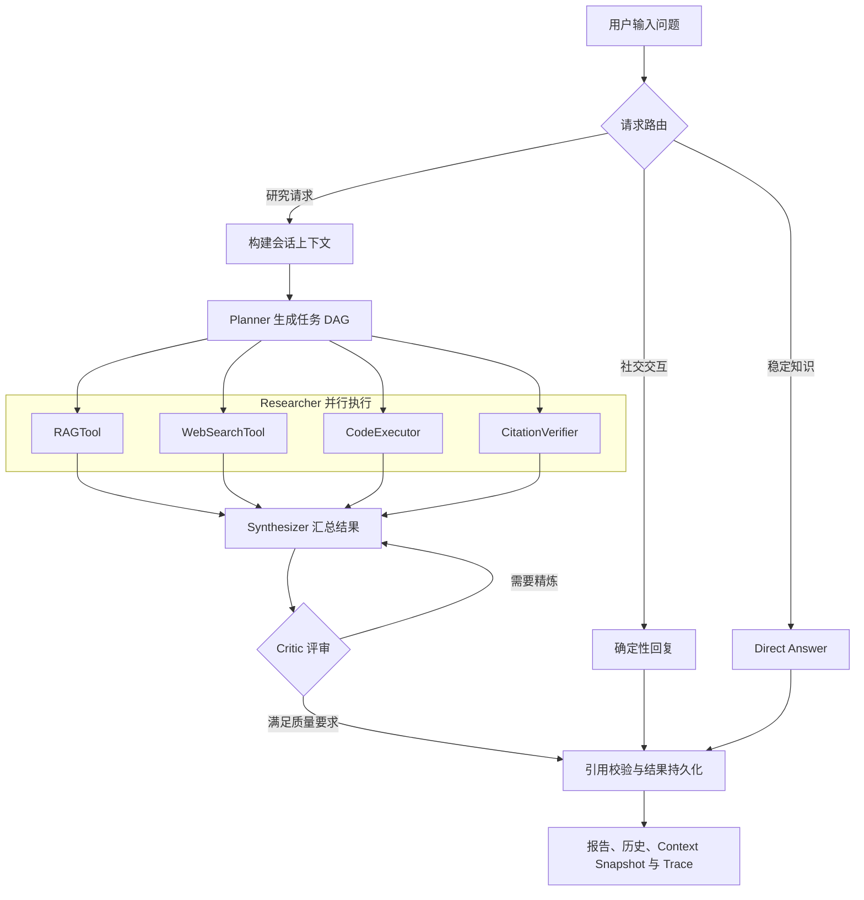

# MindForge - 自适应研究助理系统

> 全栈 Multi-Agent RAG · React 19 前端 · FastAPI 后端 · 混合检索 · SSE 流式交互

MindForge 是一个可自托管的自适应研究助理。它结合多 Agent 编排、知识库检索、
联网搜索、会话上下文和质量评审，生成带来源、历史记录和执行 Trace 的研究结果。

## 项目概述

MindForge 根据问题类型选择确定性社交回复、模型辅助直接回答或完整研究流程。复杂问题
会被拆解为可执行的子任务，由 Researcher 收集证据，Synthesizer 组织报告，Critic
评审并按策略精炼结果。

### 前端页面

| 页面 | 功能 |
| --- | --- |
| 概览 | 查看 PostgreSQL、Redis、Qdrant 状态和系统统计。 |
| 研究工作台 | 输入问题，查看实时任务进度、报告、来源、评分和费用。 |
| 知识库 | 上传、索引、启停、查看和删除文档。 |
| 研究历史 | 查看和管理已完成的研究结果。 |
| 可观测 | 查看研究 Trace、Agent、模型和工具调用。 |
| 系统配置 | 配置模型 Provider、检索策略、研究参数和 Langfuse。 |

### 核心能力

| 能力 | 说明 |
| --- | --- |
| 自适应请求路由 | 为社交交互、稳定知识问题和复杂研究请求选择合适的执行链路。 |
| 多 Agent 研究 | Planner、Researcher、Synthesizer、Critic 分工完成规划、检索、综合和评审。 |
| 会话上下文 | 支持追问、自动或手动上下文、独立研究、快照、固定、遗忘和删除。 |
| 混合检索 | 结合 Qdrant 向量检索、BM25、RRF 融合和 Cross-Encoder 重排序。 |
| 文档知识库 | 支持 PDF、DOCX、HTML、Markdown、TXT 的解析、OCR、表格和图片资产处理。 |
| 高级索引 | 支持 RAPTOR 层次摘要索引、GraphRAG 图谱索引和可选视觉索引。 |
| 多模型接入 | 支持 OpenAI、DeepSeek、Kimi、GLM、OpenAI-compatible API 和本地兼容服务。 |
| 联网搜索 | 支持 Provider 原生搜索、Tavily 和 DuckDuckGo。 |
| 流式与取消 | 通过 SSE 展示研究阶段和答案增量，并支持按 `request_id` 取消任务。 |
| 可观测性 | 记录 Agent、模型、工具、耗时、Token、费用、结果和失败原因。 |

### 工作流程


```mermaid
flowchart TD
    A[用户输入问题] --> B{请求路由}
    B -->|社交交互| C[确定性回复]
    B -->|稳定知识| D[Direct Answer]
    B -->|研究请求| E[构建会话上下文]
    E --> F[Planner 生成任务 DAG]

    subgraph G[Researcher 并行执行]
        G1[RAGTool]
        G2[WebSearchTool]
        G3[CodeExecutor]
        G4[CitationVerifier]
    end

    F --> G1
    F --> G2
    F --> G3
    F --> G4
    G1 --> H[Synthesizer 汇总结果]
    G2 --> H
    G3 --> H
    G4 --> H

    H --> I{Critic 评审}
    I -->|满足质量要求| J[引用校验与结果持久化]
    I -->|需要精炼| H
    C --> J
    D --> J
    J --> K[报告、历史、Context Snapshot 与 Trace]
```

## 技术栈

| 层级 | 技术 |
| --- | --- |
| 前端 | React 19、TypeScript、Vite、Tailwind CSS、TanStack Router/Query、Zustand |
| 前端交互 | React Flow、Recharts、react-markdown、eventsource-parser |
| 后端 | Python 3.10+、FastAPI、Pydantic、SQLAlchemy、Alembic |
| 数据 | PostgreSQL、Redis、Qdrant |
| 检索 | BGE、BM25、RRF、Cross-Encoder Reranker、RAPTOR、GraphRAG |
| 文档解析 | pdfplumber、PaddleOCR、python-docx、BeautifulSoup |
| 可观测 | 本地 Trace、Langfuse |
| 部署 | Docker Compose、CPU/GPU 依赖锁文件 |

## 项目结构

```text
MindForge/
├── src/mindforge/
│   ├── agents/          # Agent、Direct Answer 与 Orchestrator
│   ├── api/             # FastAPI、REST、SSE 和接口 Schema
│   ├── context/         # 上下文构建、压缩、快照和删除治理
│   ├── ingestion/       # 文档解析、分块、Embedding、RAPTOR
│   ├── retrieval/       # 向量、BM25、重排序与 GraphRAG
│   ├── tools/           # RAG、搜索、代码和引用校验工具
│   ├── models/          # Provider 注册表与模型适配器
│   ├── memory/          # 工作、情节和语义记忆
│   ├── services/        # 会话、索引、上下文和健康检查服务
│   └── observability/   # Trace 与 Langfuse
├── mindforge-web/       # React 前端
├── migrations/          # Alembic 数据库迁移
├── tests/               # 后端测试
├── docker-compose.yml
├── docker-compose.gpu.yml
├── .env.example
└── start.sh
```

## 快速启动

推荐在 Linux 服务器上使用 Docker Compose 部署。

### 1. 准备配置

```bash
git clone https://github.com/blankbrains/MindForge.git
cd MindForge
cp .env.example .env
```

在 `.env` 中配置数据库密码、`DATABASE_URL`、`APP_SECRET`、LLM Provider、模型和
API Key。完整配置字段见 `.env.example`。

### 2. 启动服务

CPU：

```bash
docker compose config --quiet
docker compose up -d --build
```

GPU：

```bash
docker compose \
  -f docker-compose.yml \
  -f docker-compose.gpu.yml \
  up -d --build
```

### 3. 检查状态

```bash
curl --fail http://127.0.0.1:8000/api/v1/ready
docker compose ps
docker compose logs -f mindforge
```

默认访问地址为 `http://127.0.0.1:8000`，FastAPI 文档位于 `/docs`。

## 模型、搜索与上下文配置

设置页面可为 Planner、Researcher、Critic、Synthesizer 和 Direct Answer 分别选择
模型。Provider 配置支持模型发现、工具调用、JSON 模式、流式用量统计和原生联网搜索。

联网搜索支持 Provider 原生搜索、Tavily 和 DuckDuckGo。配置 `TAVILY_API_KEY` 后，
可通过 `WEB_SEARCH_PREFER_TAVILY` 控制 Tavily 与原生搜索的优先级。

上下文系统支持自动、手动、关闭和独立研究模式。长会话使用规则摘要和可选模型压缩，
每次研究都会保存不可变 `ContextSnapshot` 供后续查看。

## API 与 SSE

| API | 作用 |
| --- | --- |
| `POST /api/v1/query` | 提交普通或 SSE 流式研究任务。 |
| `POST /api/v1/query/cancel` | 按 `request_id` 取消流式研究。 |
| `POST /api/v1/index-jobs` | 创建异步文档索引任务。 |
| `DELETE /api/v1/index-jobs/{job_id}` | 取消索引任务。 |
| `/api/v1/conversations/*` | 管理会话、消息和上下文。 |
| `/api/v1/memories/*` | 管理用户长期记忆。 |
| `/api/v1/documents/*` | 管理知识库文档和资产。 |
| `/api/v1/settings` | 管理模型、检索和运行配置。 |
| `/api/v1/observability/*` | 查看和管理 Trace。 |
| `/api/v1/health` / `/api/v1/ready` | 检查服务与依赖就绪状态。 |

流式研究会发送路由、规划、子任务、综合、评审、精炼、答案增量、取消和完成状态。前端
使用请求标识处理进度更新和取消操作。

## 配置分类

| 前缀 | 用途 |
| --- | --- |
| `API_*` | 服务地址、鉴权、上传限制和索引并发。 |
| `LLM_*` | Provider、角色模型、Embedding 和费用。 |
| `AGENT_*` | 研究模式、直接回答、超时、并发和任务限制。 |
| `WEB_SEARCH_*` / `TAVILY_*` | 联网搜索策略。 |
| `RETRIEVAL_*` | 召回、重排序和阈值。 |
| `PARSER_*` / `VISUAL_*` | 文档、OCR、表格、图片和视觉解析。 |
| `RAPTOR_*` / `GRAPH_*` | 层次索引和图谱索引。 |
| `CONTEXT_*` / `MEMORY_*` | 会话上下文、压缩、快照和记忆。 |
| `OBSERVABILITY_*` | Trace 与 Langfuse。 |
| `SANDBOX_*` | 代码执行限制。 |
| `VITE_*` | 前端请求和流式渲染。 |

## 开发与验证

```bash
ruff check src/ tests/
pytest tests/ -v -m "not integration"

npm --prefix mindforge-web run lint
npm --prefix mindforge-web run test
npm --prefix mindforge-web run build

docker compose config --quiet
```

## 安全说明

- `.env`、运行数据、索引、Trace、模型缓存和本地文档不进入 Git。
- API Key 加密保存，接口返回时展示脱敏值。
- 对外部署使用 HTTPS、访问控制和强随机密钥。
- 服务提供 CORS 配置、安全响应头、上传限制、模型发现保护和代码执行限制。

## License

[MIT](LICENSE)
