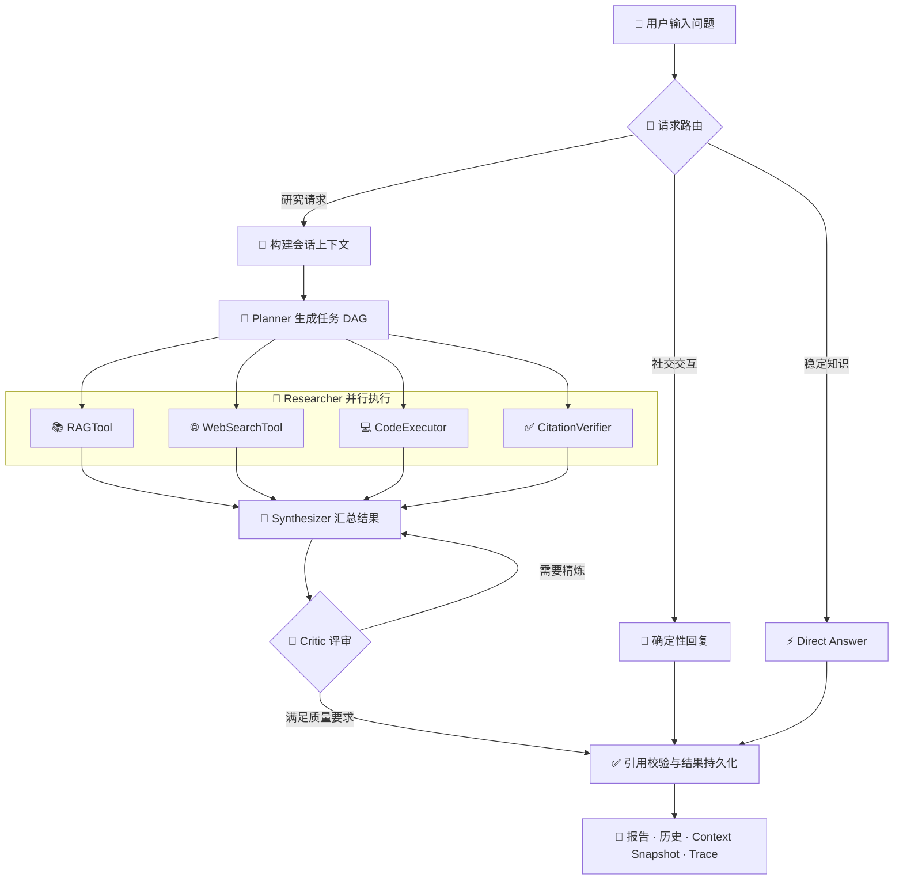

# MindForge — 自适应研究助理系统

> **全栈 Multi-Agent RAG** · React 19 前端 · FastAPI 后端 · 混合检索 · SSE 流式交互

[](https://github.com/blankbrains/MindForge/actions/workflows/ci.yml)

## 项目概述

MindForge 是一个可自托管的自适应研究助理系统，由 **Python 后端**
（FastAPI + Multi-Agent RAG）和 **React 前端**（TypeScript + Tailwind CSS）构成。
它根据问题类型选择确定性社交回复、模型辅助直接回答或完整研究流程；复杂问题会被
拆解为可执行的子任务，并结合知识库、联网搜索和工具调用生成可追溯报告。

### 🖥️ 前端界面

| 页面 | 功能 |
| --- | --- |
| 📊 **概览 Dashboard** | 查看 PostgreSQL、Redis、Qdrant 状态和系统统计。 |
| 🔬 **研究工作台** | 输入问题，查看实时任务进度、报告、来源、评分、Token 与费用。 |
| 📚 **知识库** | 上传、索引、启停、查看和删除文档。 |
| 🕐 **研究历史** | 查看和管理已完成的研究结果。 |
| 📈 **可观测** | 查看研究 Trace、Agent、模型和工具调用。 |
| ⚙️ **系统配置** | 配置模型 Provider、检索策略、研究参数和 Langfuse。 |

### 🎯 核心能力

| 能力 | 说明 |
| --- | --- |
| 🧭 **自适应请求路由** | 为社交交互、稳定知识问题和复杂研究请求选择合适的执行链路。 |
| 🧠 **多 Agent 研究** | Planner、Researcher、Synthesizer、Critic 分工完成规划、检索、综合和评审。 |
| 💬 **会话上下文** | 支持追问、自动或手动上下文、独立研究、快照、固定、遗忘和删除。 |
| 🔍 **混合检索** | 结合 Qdrant 向量检索、BM25、RRF 融合和 Cross-Encoder 重排序。 |
| 📄 **文档知识库** | 支持 PDF、DOCX、HTML、Markdown、TXT 的解析、OCR、表格和图片资产处理。 |
| 🧱 **高级索引** | 支持 RAPTOR 层次摘要索引、GraphRAG 图谱索引和可选视觉索引。 |
| ⚡ **统一模型接口** | 支持 OpenAI、DeepSeek、Kimi、GLM、OpenAI-compatible API 和本地兼容服务。 |
| 🌐 **联网搜索** | 支持 Provider 原生搜索、Tavily 和 DuckDuckGo。 |
| 📡 **SSE 流式与取消** | 实时展示研究阶段和答案增量，并支持按 `request_id` 取消任务。 |
| 📊 **可观测性** | 记录 Agent、模型、工具、耗时、Token、费用、结果和失败原因。 |

### 🔄 工作流程


```mermaid
flowchart TD
    A[🙋 用户输入问题] --> B{🧭 请求路由}
    B -->|社交交互| C[💬 确定性回复]
    B -->|稳定知识| D[⚡ Direct Answer]
    B -->|研究请求| E[🧠 构建会话上下文]
    E --> F[🧭 Planner 生成任务 DAG]

    subgraph G[🔬 Researcher 并行执行]
        G1[📚 RAGTool]
        G2[🌐 WebSearchTool]
        G3[💻 CodeExecutor]
        G4[✅ CitationVerifier]
    end

    F --> G1
    F --> G2
    F --> G3
    F --> G4
    G1 --> H[📝 Synthesizer 汇总结果]
    G2 --> H
    G3 --> H
    G4 --> H

    H --> I{🎯 Critic 评审}
    I -->|满足质量要求| J[✅ 引用校验与结果持久化]
    I -->|需要精炼| H
    C --> J
    D --> J
    J --> K[📄 报告 · 历史 · Context Snapshot · Trace]
```

### 🛠️ 技术栈

| 层 | 技术 |
| --- | --- |
| 🖥️ **前端框架** | React 19 · TypeScript · Tailwind CSS v4 · Vite |
| 🗂️ **前端状态** | TanStack Router · TanStack Query · Zustand |
| 📈 **前端交互** | React Flow · Recharts · react-markdown · eventsource-parser |
| 🤖 **Agent 编排** | Direct Answer · Planner · Researcher · Synthesizer · Critic |
| 🔎 **检索引擎** | Qdrant · BM25 · RRF · Cross-Encoder Reranker |
| 🏗️ **高级检索** | RAPTOR · GraphRAG · 可选视觉索引 |
| 🧰 **Agent 工具** | 知识库检索 · Web 搜索 · 代码执行 · 引用校验 |
| 🧩 **模型** | OpenAI · DeepSeek · Kimi · GLM · OpenAI-compatible · Local |
| 🧠 **上下文与记忆** | Conversation · Context Snapshot · Research Artifact · User Memory |
| 📄 **文档解析** | pdfplumber · PaddleOCR · python-docx · BeautifulSoup |
| 🗄️ **数据与缓存** | PostgreSQL 16 · Redis · Qdrant |
| ⚡ **API 与观测** | FastAPI · SSE · Pydantic v2 · 本地 Trace · Langfuse |
| 🐳 **部署** | Docker Compose · CPU/GPU 依赖锁文件 |

## 📁 项目结构

```text
MindForge/
├── start.sh                        # 一体化启动脚本
├── pyproject.toml                  # Python 项目与依赖声明
├── docker-compose.yml              # 应用、PostgreSQL、Redis、Qdrant 编排
├── docker-compose.gpu.yml          # GPU 部署覆盖配置
├── Dockerfile                      # 生产镜像构建
├── migrations/                     # Alembic 数据库迁移
├── .env.example                    # 运行配置模板
├── .github/workflows/ci.yml        # CI
│
├── mindforge-web/                  # React 前端
│   └── src/
│       ├── components/             # 页面与业务组件
│       ├── hooks/                  # 研究会话与数据请求 Hooks
│       ├── store/                  # Zustand 状态管理
│       ├── routes/                 # 路由定义
│       └── types/                  # TypeScript 类型
│
├── src/mindforge/                  # Python 后端
│   ├── agents/                     # Agent、Direct Answer 与 Orchestrator
│   ├── api/                        # FastAPI、REST、SSE 和接口 Schema
│   ├── context/                    # 上下文构建、压缩、快照和删除治理
│   ├── ingestion/                  # 文档解析、分块、Embedding、RAPTOR
│   ├── retrieval/                  # 向量、BM25、重排序与 GraphRAG
│   ├── tools/                      # RAG、搜索、代码和引用校验工具
│   ├── models/                     # Provider 注册表与模型适配器
│   ├── memory/                     # 工作、情节和语义记忆
│   ├── services/                   # 会话、索引、上下文和健康检查服务
│   ├── repositories/               # PostgreSQL 数据访问层
│   └── observability/              # Trace 与 Langfuse
│
└── tests/                          # pytest 测试
```

## 🚀 快速启动

### 环境要求

| 组件 | 要求 | 说明 |
| --- | --- | --- |
| 🐍 Python | `>= 3.10` | Docker 与 CI 使用 Python 3.11。 |
| 🐳 Docker | 推荐 | 一次启动应用、PostgreSQL、Redis 和 Qdrant。 |
| 🟢 Node.js | `>= 22` | 与 Dockerfile、CI 和 Vite 8 对齐。 |
| 📦 npm | `>= 10` | 用于前端开发和构建。 |

### 🐳 1. 使用 Docker Compose 启动

```bash
git clone https://github.com/blankbrains/MindForge.git
cd MindForge
cp .env.example .env

# 配置 .env：DATABASE_URL、POSTGRES_PASSWORD、APP_SECRET、LLM Provider 和 API Key
docker compose config --quiet
docker compose up -d --build
```

GPU 部署：

```bash
docker compose \
  -f docker-compose.yml \
  -f docker-compose.gpu.yml \
  up -d --build
```

### 🟢 2. 检查服务

```bash
curl --fail http://127.0.0.1:8000/api/v1/ready
docker compose ps
docker compose logs -f mindforge
```

默认访问地址为 `http://127.0.0.1:8000`，FastAPI 接口文档位于 `/docs`。

### 🧩 3. 本地开发

```bash
bash start.sh
bash start.sh --dev
```

前端单独启动：

```bash
cd mindforge-web
npm ci
npm run dev
```

## ⚙️ 运行配置

### 统一配置规则

项目根目录 `.env` 是后端、Vite 和 Docker Compose 的统一运行配置源。配置
`DATABASE_URL`、数据库密码、`APP_SECRET`、Provider、模型和 API Key 后，
通过 `docker compose config --quiet` 检查配置。

### 模型配置

设置页面可为 Planner、Researcher、Critic、Synthesizer 和 Direct Answer 分别选择
模型。Provider 支持模型发现、工具调用、JSON 模式、流式用量统计和原生联网搜索。

| Provider | 用途 |
| --- | --- |
| OpenAI | OpenAI 原生 API 与 OpenAI Responses 搜索。 |
| DeepSeek | DeepSeek API。 |
| Kimi | Moonshot/Kimi API 与内置联网。 |
| GLM | 智谱 GLM API 与 Web Search。 |
| 通用接口 | 其他 OpenAI-compatible 云服务。 |
| 本地模型 | vLLM、Ollama、LM Studio 等兼容服务。 |

### 联网搜索与上下文

联网搜索支持 Provider 原生搜索、Tavily 和 DuckDuckGo。配置 `TAVILY_API_KEY` 后，
可通过 `WEB_SEARCH_PREFER_TAVILY` 控制 Tavily 与原生搜索的优先级。

上下文系统支持自动、手动、关闭和独立研究模式。长会话使用规则摘要和可选模型压缩，
每次研究都会保存不可变 `ContextSnapshot` 供后续查看。

## 📡 API 与 SSE

| API | 作用 |
| --- | --- |
| `POST /api/v1/query` | 提交普通或 SSE 流式研究任务。 |
| `POST /api/v1/query/cancel` | 按 `request_id` 取消流式研究。 |
| `POST /api/v1/index-jobs` | 创建异步文档索引任务。 |
| `DELETE /api/v1/index-jobs/{job_id}` | 取消索引任务。 |
| `/api/v1/conversations/*` | 管理会话、消息和上下文。 |
| `/api/v1/memories/*` | 管理用户长期记忆。 |
| `/api/v1/documents/*` | 管理知识库文档和资产。 |
| `/api/v1/settings` | 管理模型、检索和运行配置。 |
| `/api/v1/observability/*` | 查看和管理 Trace。 |
| `/api/v1/health` / `/api/v1/ready` | 检查服务与依赖就绪状态。 |

流式研究通过 SSE 发送路由、规划、子任务、综合、评审、精炼、答案增量、取消和完成
状态。前端使用请求标识处理进度更新和取消操作。

## 🔄 CI/CD 与验证

GitHub Actions 自动执行：

- **ruff check**：Python 静态检查。
- **pytest**：后端单元与回归测试。
- **前端质量检查**：ESLint 与 TypeScript/Vite 生产构建。
- **Docker Compose 校验**：展开并检查部署配置。

本地验证命令：

```bash
ruff check src/ tests/
pytest tests/ -v -m "not integration"

npm --prefix mindforge-web run lint
npm --prefix mindforge-web run test
npm --prefix mindforge-web run build

docker compose config --quiet
```

## ✨ 技术亮点

### 🧠 自适应 Agent 编排

- **多路径路由**：社交交互、直接回答和完整研究使用不同执行链路。
- **DAG 任务分解**：Planner 为复杂问题生成有依赖关系的子任务。
- **角色合约**：Planner、Researcher、Synthesizer 和 Critic 保持明确职责边界。
- **质量评审**：Critic 评审结果并驱动受控精炼。

### 🔍 混合检索与知识库

- **Dense + BM25 + RRF**：融合语义检索和关键词检索结果。
- **Cross-Encoder 精排**：对候选片段进行相关性重排序。
- **RAPTOR + GraphRAG**：支持层次摘要索引与实体关系索引。
- **异步索引任务**：文档上传、解析、Embedding 和索引进度可追踪、可取消。

### 💬 上下文与记忆治理

- **可观测上下文**：展示候选内容、选择原因、Token 成本和实际使用快照。
- **长会话压缩**：规则摘要与模型压缩配合控制上下文长度。
- **细粒度治理**：支持固定、排除、遗忘和删除会话内容。

### 📈 可观测与工程化

- **完整 Trace**：记录 Agent、模型、工具、耗时、Token、费用和失败原因。
- **多 Provider 适配**：模型、工具调用、JSON 模式和联网能力按 Provider 配置。
- **可复现部署**：Docker Compose 与 CPU/GPU 依赖锁文件支持一致的部署流程。
- **安全配置**：API Key 加密保存，接口返回脱敏值，支持访问控制和安全响应头。

## 📄 许可证

本项目基于 [MIT 协议](LICENSE) 开源，可自由使用、修改和分发。

---

<p align="center">
  <sub>Built with React 19 · FastAPI · Qdrant · PostgreSQL</sub>
</p>
